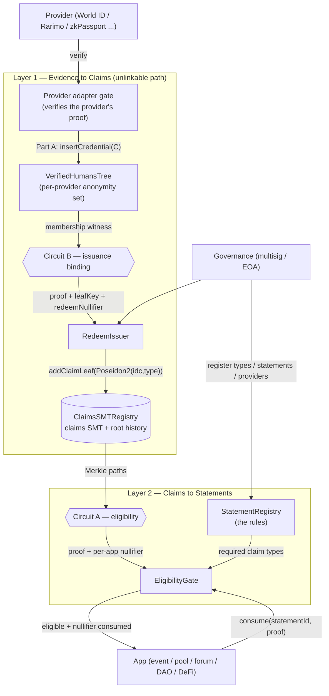

# ZuitzPass — project overview

_A neutral, provider-agnostic, on-chain **zk statements layer**. This one document is meant to be
enough to understand the whole project without having built it. For deeper detail see
[`contracts/ARCHITECTURE_UPDATED.md`](contracts/ARCHITECTURE_UPDATED.md) (the canonical design),
[`contracts/PHASE3_UNLINKABLE_DESIGN.md`](contracts/PHASE3_UNLINKABLE_DESIGN.md) (the unlinkable
identity layer) and [`STATUS.md`](STATUS.md) (running status)._

---

## 1. What it is, in one breath

Real-world access rules are conjunctions like *"a unique human **AND** over 18 **AND** attended
Cannes 2025 **AND** holds ≥ 0.02 ETH."* No single provider or ZK circuit can prove all of that.
ZuitzPass splits every such rule into **two layers**:

| Layer | What happens | Cost |
|---|---|---|
| **1 · Evidence → Claims** | each atomic fact is verified by whatever mechanism fits (World ID, Rarimo, zkPassport, zkTLS, a signed attestation, a plain on-chain read) and recorded as a typed **claim** bound to an identity | ZK / a signature, paid **once per fact** |
| **2 · Claims → Statements** | a **statement** is a boolean formula over claim types; an app checks it and (optionally) consumes it once | a proof or a few SLOADs |

Adding a new condition = register a claim type + permission an issuer. **You never write a circuit
per condition.** That is what turns "verify any provable statement" into a product instead of a
research program. Apps integrate **one interface**, not N provider SDKs.

---

## 2. Two privacy modes (both deployed)

The same two-layer idea ships in two flavours, and **both are live on World Chain Sepolia**:

- **Phase 1 — pseudonymous.** Claims live in a mapping keyed by a per-provider subject
  `keccak256(providerId, nullifier)`. Apps call `check` / `consume` (plain Solidity, a few SLOADs).
  Simple and cheap, but an app sees the same subject across visits — pseudonymous, not unlinkable.
- **Phase 3 — strongly unlinkable (the target product).** One **master identity** per person; all
  claims hang off it inside a Sparse Merkle Tree. To use a statement an app receives a **ZK proof +
  a per-app nullifier** — it learns only *"eligible, nullifier X"*, never the identity, the
  credential, or the wallet. A different app sees a different nullifier for the same person.

The **StatementRegistry is shared** between them: a statement (the rule) is defined once and can be
evaluated pseudonymously (Phase 1 `check`) or unlinkably (Phase 3 proof).

---

## 3. Identity & keys (Phase 3)

- **Master secret** `s` — random, generated on the user's device, never leaves it, never on chain.
- **Identity commitment** `idc = Poseidon2(s, 0)` — the subject every claim hangs off. Never revealed.
- **Claim leaf** in the claims SMT: `key = Poseidon2(idc, claimType)`, `value = Poseidon3(issuerId,
  expiresAt, 0)`. The tree is opaque — scanning it reveals neither who owns a leaf nor which leaves
  share an owner.
- **Per-app nullifier** `Poseidon(s, appId, contextId)` — deterministic per (identity, app, epoch),
  unlinkable across apps because `s` is secret. `contextId` (a month, a proposal, an event) turns
  "once per X" into a parameter.

**Claim types** use the canonical form `keccak256(name) mod p` (a BN254 field element), so the same
name is one identity in both the pseudonymous mappings and the ZK circuits.

---

## 4. How the contracts connect



Read it as three hops: **(a)** a provider adapter verifies a human and drops a blinded credential
into that provider's `VerifiedHumansTree`; **(b)** the user privately redeems it (Circuit B) and
`RedeemIssuer` writes an opaque claim leaf into the `ClaimsSMTRegistry`; **(c)** to use an app the
user proves eligibility over those claims (Circuit A) and the `EligibilityGate` verifies it and
burns a per-app nullifier. The `StatementRegistry` supplies the rule; governance configures.

The **Phase-1 (pseudonymous)** path is the same shape without the circuits: the provider gate calls
`ClaimsRegistry.issue(subject, type)` directly, and the app calls `StatementRegistry.check/consume`.

---

## 5. Contract reference

### Layer 2 — statements (shared by both modes)
- **`StatementRegistry`** — stores each rule as `Statement{ allOf[], anyOf[], consumable,
  metadataURI }`. `check(subject, id)` is a view; `consume(subject, id, contextId)` records one-time
  use keyed `[statementId][app][contextId][subject]`.
- **`ZuitzerlandGovernance`** — the ban wrapper; drives layer-wide subject bans via
  `INullifierBanControl`.

### Layer 1 — pseudonymous (Phase 1)
- **`ClaimsRegistry`** — typed claims per subject (mapping), owner-registered claim types, per-type
  issuer allowlist, `issue` / `revoke`, `hasValidClaim` (exists && !expired && !banned).
- **Issuers** (write claims):
  - **`WorldIDGate`** — verifies a World ID proof (calls the World ID Router) → issues
    `UNIQUE_HUMAN_WORLDID`. (Also the Rarimo `ZuitzPassExecutor`, built, blocked only on a passport.)
  - **`AttestorIssuer`** — an allow-listed signer attests a fact (e.g. event attendance). Zero ZK.
  - **`OnchainReadIssuer`** — reads public state (`balanceOf`) → issues a claim. Zero ZK.
- **`SubsidyPool`** (`src/demo/`) — an example consumer: pays a subsidy gated on `check`/`consume`.

### Layer 1 — unlinkable (Phase 3)
- **`RootedSMTRegistry`** — shared base: a dl-solarity Sparse Merkle Tree (Poseidon hashers, the
  hash the circuits use) + root history + a single permissioned `writer`.
- **`ClaimsSMTRegistry`** — the unlinkable claims spine (`RootedSMTRegistry`). Its `writer`
  ("redeemer") is `RedeemIssuer`. Leaves are `Poseidon2(idc, claimType)` → opaque.
- **`VerifiedHumansTree`** — per-provider anonymity set (`RootedSMTRegistry`): Part A inserts a
  credential commitment `C = Poseidon2(s, r)`. This is the crowd a user hides in during redeem.
- **`RedeemIssuer`** — the Part-B entrypoint: verifies a Circuit-B proof, checks provider
  permission + credential-root freshness + expiry policy, consumes a one-time `redeemNullifier`, and
  writes the claim leaf. Generic over providers (config, not code).
- **`EligibilityGate`** — the one app-facing gate: verifies a Circuit-A proof, checks root freshness,
  time, `app_id` scope, that the proof's claim types equal the statement's `allOf`, and consumes the
  per-app nullifier.
- **Verifiers** — `EligibilityVerifier` / `IssuanceVerifier`: the Barretenberg UltraHonk Solidity
  verifiers (keccak flavour) for Circuit A / Circuit B.

---

## 6. The circuits — what they are and when they matter

Three Noir circuits, all sharing one validated **SMT-membership gadget** (`compute_root`, matched
to the real dl-solarity tree). They matter **only in the unlinkable (Phase 3) path** — Phase 1 uses
no circuits.

- **Circuit A — eligibility** (`eligibility_proof/`). Used **when an app checks a statement**. Proves
  "under claims-root R, valid non-expired leaves of the required claim types all exist for one
  identity I control, and here is `Poseidon(s, appId, contextId)`." Output: eligible + a per-app
  nullifier. This is what makes app-time unlinkable.
- **Circuit B — issuance binding** (`issuance_proof/`). Used **when a user connects a provider** (the
  redeem step). Proves "I own some credential `C` in this provider's `VerifiedHumansTree` (membership,
  without revealing which) and I'm writing the leaf `Poseidon2(idc, claimType)`" plus a single-use
  `redeemNullifier`. This is what binds a verified human to a hidden identity **without publicly
  linking the provider nullifier to `idc`** (strong privacy). One generic Circuit B serves every
  provider — `claimType` is a public input.
- **Circuit 1 — membership** (`membership_proof/`, archived). The original single-leaf precursor that
  Circuits A and B generalize. Kept as reference; not in the shipping path.

**Why the anonymity set matters:** connecting a provider reveals its nullifier publicly. To avoid
linking it to `idc`, issuance is split — Part A (public) drops a blinded credential into
`VerifiedHumansTree`; Part B (private, Circuit B) proves membership over the *whole set* without
revealing which member. Privacy grows with the number of credentials in the tree.

---

## 7. End-to-end (the unlinkable flow, as proven live)

1. **Connect a provider (Part A).** The provider adapter verifies the user is a unique human (its
   used-nullifier set stops double-registration) and inserts `C = Poseidon2(s, r)` into that
   provider's `VerifiedHumansTree`.
2. **Redeem (Part B).** The user proves Circuit B and calls `RedeemIssuer.redeem(...)`, which writes
   the opaque claim leaf `Poseidon2(idc, claimType)` into `ClaimsSMTRegistry`. Reusable forever.
3. **Use an app.** The organizer has registered a statement (e.g. `allOf = [UNIQUE_HUMAN]`). The user
   proves Circuit A against the claims tree and calls `EligibilityGate.consume(statementId, contextId,
   signal, proof, pub)`.
4. **The app acts.** The gate verifies the proof, checks freshness/scope, consumes the nullifier, and
   the app learns only *"eligible, nullifier X."* A replay reverts `AlreadyConsumed`; a different app
   sees a different nullifier.

Proven on World Chain Sepolia — Circuit-B redeem then Circuit-A consume, tx
`0xeb0d8400a782841c4756d0aca9a4850b1af0e0b4547caa4a8b937f0fc84c602d` (nullifier consumed = true).

---

## 8. Adding a new connector / provider — the whole recipe

Adding provider N is **O(1)**: no new circuit, no changes to the claims tree, the eligibility
circuit/gate, or the redeem entrypoint, and no changes to any app.

**Reused for free:** `ClaimsSMTRegistry`; Circuit A + its verifier + `EligibilityGate`; **Circuit B +
its verifier** (generic — `claimType` is a public input); `RedeemIssuer`; `RootedSMTRegistry`.

**What you add:**
1. A **provider adapter** that verifies *that provider's* proof (the one irreducible piece — each
   provider is a different cryptosystem; same overhead as Phase 1).
2. A **`VerifiedHumansTree` instance** — `new VerifiedHumansTree(...)`, no new code; set the adapter
   as its `writer`.
3. A **Part-A hook** in the adapter: on success, `verifiedHumansTree.insertCredential(C)`.
4. `RedeemIssuer.registerProvider(providerId, credTree, claimType, issuerId)` — one governance tx.
5. Register the claim type if new — one governance tx.

**Overhead:** one adapter (unavoidable) + a tree *deploy* (no code) + a small hook + two config txs.
A provider that mints several claim types registers under multiple `providerId`s pointing at the
same tree — still config, and it composes (`redeemNullifier` differs per type).

---

## 9. Deployed addresses (World Chain Sepolia, chainId 4801)

**Phase 1 — pseudonymous statements layer**

| Contract | Address |
|---|---|
| StatementRegistry (shared) | `0x9518201B65b3b9a26a80Cf7605952620C9498001` |
| ClaimsRegistry | `0x5d74F3a39C465f48d545757e65AcCbe55197765B` |
| WorldIDGate (live, real appId) | `0x67188d45F49854e0112dfC7c4c002527fdFF99BC` |
| AttestorIssuer | `0x03d8feaf664074a88c0f28596ae4fa79c24fef7f` |
| OnchainReadIssuer | `0x4d59b58bb922c878037db14dab536b0d2403df3b` |
| ZuitzerlandGovernance | `0x2706b28096157F884182a6ec37073b361ebc86AB` |

**Phase 3 — unlinkable stack**

| Contract | Address |
|---|---|
| ClaimsSMTRegistry (claims SMT) | `0xED95aCC61243503144D3C17AC130f3051CE99283` |
| EligibilityGate | `0x8413A17eE390a84357ef175c32BC77283D6f6af7` |
| EligibilityVerifier (Circuit A) | `0xA3459Be47Acf9D1364E49EC2a21734DF3BED2f81` |
| RedeemIssuer | `0xEa23848413b452F8be43B51D4eB1437C0C62ae45` |
| IssuanceVerifier (Circuit B) | `0x696398AB1a46F265aaF68fc7aC9eE648650038cb` |
| VerifiedHumansTree (worldid) | `0xA8Fd0C94a2773aEc344Ab15Eb812E668bF4424f5` |

**Key identifiers**
- Provider `worldid` = `keccak256("worldid")` = `0xfd9d940269fec4349b9232989173ce30b9c86c6048f690fe7143217b9f5b5b09`
- Claim type `UNIQUE_HUMAN` (Phase 3, `keccak mod p`) = `0x28c2eef236608509ec93078138b2b9ae971aeecd1e018b1880231789d5402b55`
- Phase-1 launch statement `ZUITZ_LAUNCH_WORLDID` = `0x0767b4d8791ef6b37103f77cd4cf05a9932c60a392f5728ac59ad3fadb898191`
- Phase-3 demo statement `DEMO_HUMAN_ONLY` = `0x18c787348fb74d43a2e88c451174244bb3d2249d56d7b7ea57f464008a50f108`

**Milestone transactions**
- World ID real proof → on-chain claim (Phase 1): `0x5fc84d0046ad4f622c8bbc9d1f97750b3153c35fc3062856c08c0ffe4af91525`
- Unlinkable end-to-end consume (Phase 3): `0xeb0d8400a782841c4756d0aca9a4850b1af0e0b4547caa4a8b937f0fc84c602d`

---

## 10. Repo map

| Path | What |
|---|---|
| `contracts/src/` | Phase-1 layer: `ClaimsRegistry`, `StatementRegistry`, `WorldIDGate`, `ZuitzPassExecutor` (Rarimo), `issuers/`, `demo/SubsidyPool` |
| `contracts/src/phase3/` | Phase-3 unlinkable: `RootedSMTRegistry`, `ClaimsSMTRegistry`, `VerifiedHumansTree`, `RedeemIssuer`, `EligibilityGate`, verifier interfaces |
| `contracts/src/rarimo/` | Vendored Rarimo SDK (do not edit) |
| `contracts/src/archive/`, `test/archive/` | Archived Path B (ERC-7812 gate) — reference only |
| `contracts/script/` | Deploy + fixture-generator scripts (`DeployWorldIDStack`, `DeployPhase3`, `DeployPhase3Issuance`, `Generate*Fixture`, `Seed*`, `Register*`) |
| `contracts/test/` | Foundry unit + fork tests (118 unit tests green) |
| `contracts/frontend/`, `frontend-idkit/` | Phase-1 statements demo UI; World ID v4 (IDKit) proof-capture app |
| `eligibility_proof/` | Circuit A (Noir) |
| `issuance_proof/` | Circuit B (Noir) |
| `membership_proof/` | Circuit 1 (archived, Noir) |
| `contracts/ARCHITECTURE_UPDATED.md`, `PHASE3_UNLINKABLE_DESIGN.md`, `STATUS.md` | Canonical design / unlinkable spec / status |

---

## 11. Build, test, reproduce

```bash
# contracts (Foundry)
cd contracts
forge build
forge test                               # 118 unit tests (non-fork)
FORK=true forge test --match-path test/WorldIDGate.fork.t.sol -vvv   # live-chain fork tests

# circuits (Noir + Barretenberg, WSL)
cd eligibility_proof && nargo test       # Circuit A
cd ../issuance_proof && nargo test       # Circuit B

# on-chain verifiers are exported with the KECCAK oracle hash:
bb prove --scheme ultra_honk --oracle_hash keccak ...
```

The live demo (seed → Circuit-B redeem → Circuit-A consume) is reproduced deterministically by the
scripts in `contracts/script/`: `SeedVerifiedHumans` (populates the on-chain `VerifiedHumansTree`),
`GenerateIssuanceFixture` / `GenerateEligibilityLiveFixture` (emit the circuit `Prover.toml`s), and
`RegisterDemoStatement`. The witness identity is fixed (`secret = 424242`, blinding `r = 987654321`)
so the fixtures and the on-chain roots line up.

---

## 12. Status & what's next

**Done & live:** Phase-1 pseudonymous layer + a real World ID proof issuing a claim; Phase-3
unlinkable pipeline (both circuits + all contracts) deployed and **proven end-to-end on-chain**.

**Open directions (none blocking):**
- **ERC-7812 cross-chain anchor** — post `claimsRoot` to Ethereum L1 so other chains verify the same
  proofs: "one registry, many chains."
- **Real Part-A hook** — wire the live `WorldIDGate` to `insertCredential` so credentials come from
  actual provider verification (the demo seeded them by script).
- **Multi-claim demo** — extend the single-`HUMAN` live demo to a full `human AND over18 AND
  attended` conjunction.
- **Client-side proving UX / relayer** — the pieces a production app needs around the circuits.

**Honest caveats:** anonymity-set privacy scales with the number of Part-A credentials; volatile
facts (e.g. ETH balance) are live-checked, not stored as claims; the two circuits + SMT gadget want
a proper audit before mainnet.
