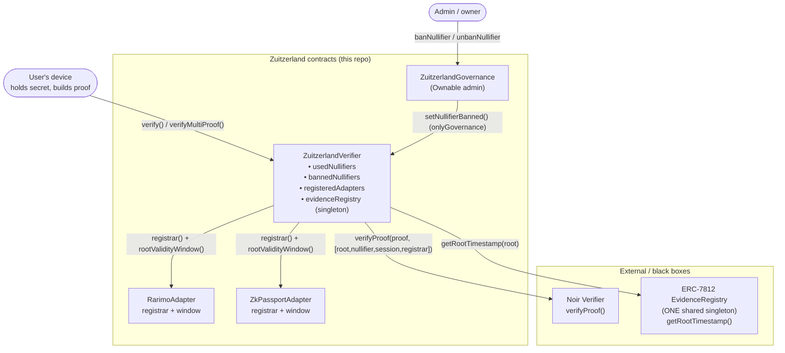
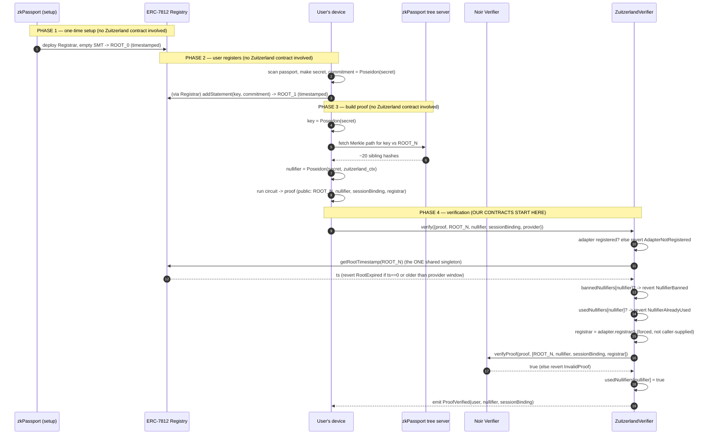
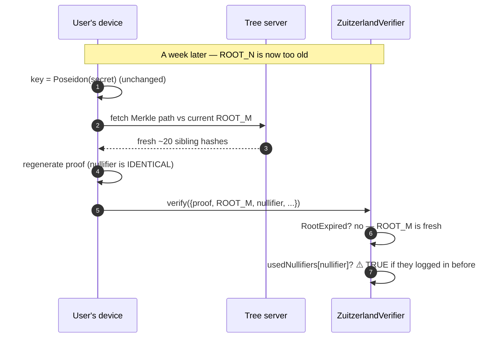
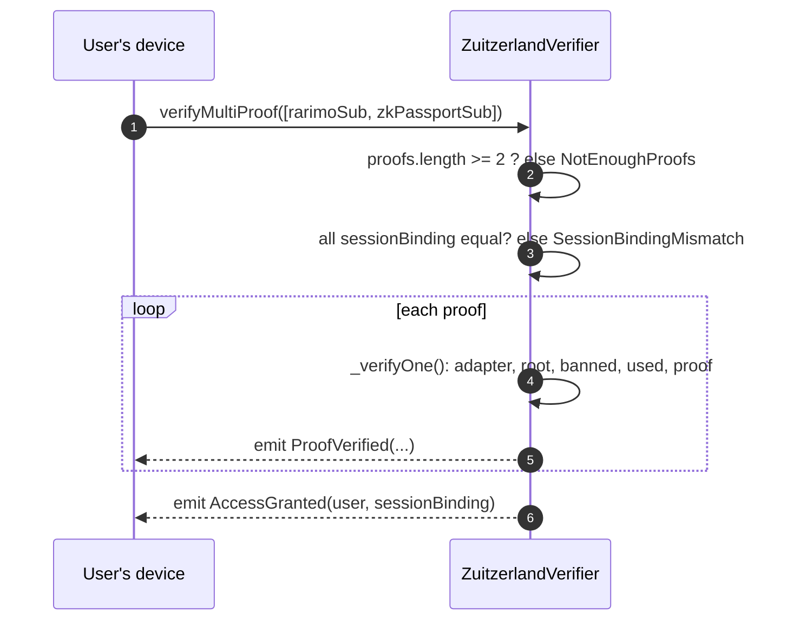
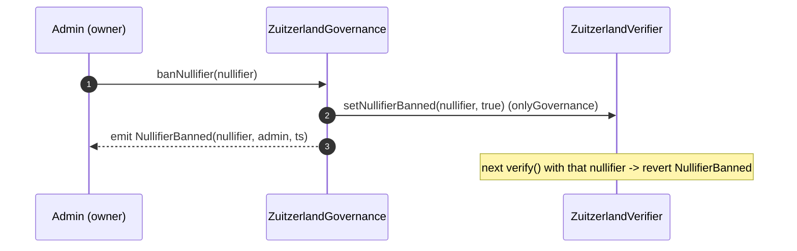
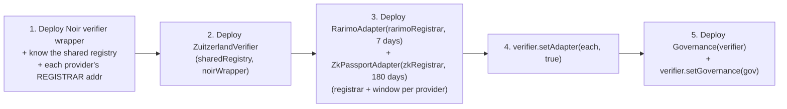

# Zuitzerland Smart Contracts — Architecture

Handoff doc for the frontend engineer. It explains **what each contract does**, **how
they talk to each other**, and **exactly where they plug into the end-to-end (E2E) user
flow** you described.

> **Mental model first.** The smart contracts only do work in **Phase 4** (verification).
> Phases 1–3 (registry setup, passport registration, proof generation) happen in the
> ERC-7812 registry + the provider's servers + the user's device. Our contracts are the
> *bouncer at the door*: they don't know who you are, they just check your proof, your
> nullifier, and that your root is fresh. Keep that boundary in mind while reading.

---

## 1. The actors (who is who)

| Actor | In your E2E flow | In our code |
|---|---|---|
| **ERC-7812 EvidenceRegistry** | The **single shared singleton** at `0x781246D2256dc0C1d8357c9dDc1eEe926a9c7812` holding ONE global SMT + root timestamps for ALL providers | External. We only *read* it (`getRootTimestamp`). |
| **Provider Registrar** | zkPassport / Rarimo contract that writes commitments into the shared SMT. Statements land at `getIsolatedKey(registrar, key)`, so the registrar identifies the provider | External. We never call it; we need its **registrar address** (proof-bound). |
| **Provider's off-chain tree server** | Serves Merkle paths to the user's client | External, off-chain. Not a contract. |
| **Noir verifier** | The exported ZK verifier that runs the proof math | External, black box. We call `verifyProof(proof, publicInputs)`. |
| **`ZuitzerlandVerifier`** | "Zuitzerland's smart contract" in Phase 4 | **Ours.** The bouncer / entry point. Holds the one registry address. |
| **`ZuitzerlandGovernance`** | The ban admin | **Ours.** Flips ban flags. |
| **`RarimoAdapter` / `ZkPassportAdapter`** | Per-provider **policy**: which registrar + how long its roots stay fresh | **Ours.** Hold `registrar` + `rootValidityWindow`. NOT registry routers — there is only one registry. |

---

## 2. Contract relationship diagram



**Why the adapters exist (updated):** ERC-7812 is ONE shared registry with ONE global
root, so adapters are *not* registry routers. The verifier itself calls the single
registry's `getRootTimestamp`. Each adapter instead supplies two provider-specific
facts: the **registrar address** (which the verifier forces into the proof's public
inputs, so a proof is provably scoped to that provider) and the **root-validity window**
(how fresh the global root must be for that provider). That combination is what makes
per-provider policy both possible and non-gameable.

---

## 3. Where the contracts sit in your E2E flow

Your Phases 1–3 don't touch our contracts at all — they're registry + client + server
work. Here's the full picture with the boundary made explicit:



### Step-by-step mapping to your flow (Phase 4)

Your Phase 4 lists three checks; our `_verifyOne()` runs them in this exact order
(plus a provider-registration guard up front):

| Your Phase 4 wording | Our code | Revert if fails |
|---|---|---|
| (implicit: which provider?) | `registeredAdapters[provider]` | `AdapterNotRegistered` |
| "calls `getRootTimestamp(ROOT_N)` … within last 24 hours" | `getRootTimestamp(root)` on the shared registry, compared to `adapter.rootValidityWindow()` | `RootExpired` |
| "checks nullifier against banned list" | `bannedNullifiers[nullifier]` | `NullifierBanned` |
| "checks nullifier against used list" | `usedNullifiers[nullifier]` | `NullifierAlreadyUsed` |
| "calls zkPassport's verifier contract with proof + public inputs" | `noirVerifier.verifyProof(proof, [root, nullifier, sessionBinding, registrar])` | `InvalidProof` |
| "nullifier is added to the used list" | `usedNullifiers[nullifier] = true` | — |
| "user is granted access" | `emit ProofVerified(...)` | — |

> **Two refinements vs. your original wording (both because ERC-7812 is a single shared
> registry):**
> 1. **One registry, not per-provider.** The verifier calls `getRootTimestamp` on the
>    single singleton directly. The adapter no longer routes a registry call — it only
>    supplies the per-provider *freshness window* used to judge the timestamp.
> 2. **Registrar is bound into the proof.** Because all providers share one tree,
>    "which provider" is expressed by the **registrar** that wrote your leaf
>    (`getIsolatedKey(registrar, key)`). The verifier forces the chosen adapter's
>    registrar into public input #3, so a proof made under Rarimo's registrar cannot be
>    replayed through the zkPassport adapter to borrow its longer window.

---

## 4. Phase 5 (root expired) — nothing changes on-chain

Your Phase 5 is entirely client-side: same `secret`, same leaf, fetch a **fresh Merkle
path** against the new root `ROOT_M`, regenerate the proof. From our contract's point of
view it's just another `verify()` call with a newer `root`. The **nullifier is the same**
(`Poseidon(secret, zuitzerland_ctx)` doesn't depend on the root) — which is the subtle
part below.



> ℹ️ **Two timelines that are easy to confuse — keep them separate.**
>
> **Timeline A — inactivity / coming back later.** "User didn't open the app for 3
> months, then proves membership again." This has **nothing to do with the nullifier.**
> The secret and the leaf are unchanged; only the *root* went stale. The user fetches a
> fresh Merkle path against the current root and re-proves. Whether that's accepted is
> purely the **root-validity window** (§3), which is now a per-provider parameter — e.g.
> `ZkPassportAdapter(zkRegistry, 180 days)` happily accepts a member returning after 3
> months. ✅ **Already handled; no nullifier involved.**
>
> **Timeline B — one-time actions.** Zuitzerland is "mostly one-time actions" (vote once
> on a proposal, claim once, react once). Whether something is one-time-forever is
> decided by **how the circuit scopes the nullifier**, not by the contract — the contract
> just remembers an opaque `bytes32`:
>
> | Circuit derivation | "used forever" means | Result |
> |---|---|---|
> | `Poseidon(secret, app_context)` — one **global** value (current circuit) | one nullifier per person, ever | person can do **exactly one action, ever** ❌ |
> | `Poseidon(secret, app_context, actionId)` — **per action** | one nullifier per (person, action) | person can do **each action once**, across many actions over time ✅ |
>
> **Decision taken:** for the PoC we keep the contract exactly as-is (`usedNullifiers`
> marked forever). That is already correct **provided the nullifier is scoped per action**.
> When Zuitzerland introduces distinct actions (polls/votes/claims), the **circuit** adds
> an `actionId` public input so the nullifier becomes `Poseidon(secret, app_context,
> actionId)`; the public-input array then grows to `[root, nullifier, sessionBinding,
> actionId]` and the contract passes it straight through. No `ZuitzerlandVerifier` logic
> change is needed — only the public-input array and the Noir-verifier wrapper move
> together. Until then, the basic membership gate works as written.

---

## 5. Multi-provider login (Rarimo + zkPassport together)

When a user proves membership with **two** providers in one session, both proofs must
carry the **same `sessionBinding`** (`hash(wallet, nonce)`). This blocks two different
users from each contributing one proof and colluding to look like one member.



Note the ordering: we check **all** session bindings match **before** consuming any
nullifier, so a mismatched batch reverts cleanly with no half-applied state.

---

## 6. Governance / ban flow



`bannedNullifiers` lives on the **verifier** (that's where checks happen), but only the
registered `governance` contract may flip it. V2 (vote-based quorum bans via ZK proofs)
is marked with a comment in `ZuitzerlandGovernance.sol`, not implemented.

---

## 7. What the frontend actually calls

```solidity
struct ProofSubmission {
    bytes   proof;          // ZK proof bytes from the Noir circuit
    bytes32 root;           // ROOT_N the user proved against
    bytes32 nullifier;      // Poseidon(secret, app_context)
    bytes32 sessionBinding; // hash(wallet, nonce) — reuse across a session
    address provider;       // address of the registered adapter (Rarimo / zkPassport)
}
```

- **Single-provider login:** `verifier.verify(submission)`
- **Dual-provider login:** `verifier.verifyMultiProof([rarimoSub, zkPassportSub])` with
  identical `sessionBinding` on both.

> Note: the frontend does **not** put `registrar` in `ProofSubmission`. The contract
> derives it from the chosen `provider` adapter and appends it to the public inputs. The
> client must, however, generate the proof using that provider's registrar address (see
> the circuit coordination note) or verification will fail.

**Public-input order is LOCKED by the circuit: `[root, nullifier, sessionBinding, registrar]`.**
Do not reorder anywhere. (Grew from 3 to 4 inputs once ERC-7812's isolated-key design
was understood — see `CIRCUIT1_ISOLATED_KEY_NOTE.md` for the circuit side.)

### Events to listen for
- `ProofVerified(address indexed user, bytes32 nullifier, bytes32 sessionBinding)`
- `AccessGranted(address indexed user, bytes32 sessionBinding)` (multi-proof only)
- `NullifierBanned` / `NullifierUnbanned` (from governance)

### Errors to surface in the UI
`RootExpired`, `NullifierBanned`, `NullifierAlreadyUsed`, `InvalidProof`,
`SessionBindingMismatch`, `AdapterNotRegistered`, `NotEnoughProofs`.

---

## 8. Deployment / wiring order



## 9. Decisions & deferred items

**Resolved**
1. **Inactivity / returning members** → handled by the **per-provider root-validity
   window** (§3), not the nullifier. A member returning after months just re-proves
   against a fresh root. Set each provider's window to match how long its credential
   should stay trusted (e.g. zkPassport `180 days`, Rarimo `7 days`).
2. **One-time actions** → keep the contract as-is (`usedNullifiers` forever). This is
   correct **once the nullifier is scoped per action** in the circuit. See the table in
   §4. No contract change needed now.
3. **Single shared ERC-7812 registry** → confirmed from the spec: ALL providers share one
   singleton + one global root; isolation is by `getIsolatedKey(registrar, key)`.
   Contracts refactored: verifier holds one registry, adapters hold `registrar` + window,
   and the registrar is bound into the proof's public inputs (now 4). Done.

**Deferred (revisit when "actions" are introduced)**
3. **Per-action nullifier (circuit coordination)** — when Zuitzerland adds distinct
   actions (votes/claims), the circuit adds an `actionId` public input so the nullifier
   is `Poseidon(secret, app_context, actionId)`. The public-input array grows to
   `[root, nullifier, sessionBinding, actionId]`; the contract passes it through
   unchanged. Coordinate this with the circuit dev (Circuit 1 currently hardcodes a
   single global `app_context`).
4. **Real Noir verifier signature** — Circuit 1 exported an **UltraHonk** verifier whose
   function signature differs from the `verifyProof(bytes, bytes32[])` black-box interface
   used here. We deliberately keep the interface as-is; at wiring time we add a thin
   wrapper contract implementing `INoirVerifier` that translates to the real verifier.
   `ZuitzerlandVerifier` itself does not change. If item 3 lands first, the wrapper and
   the public-input array move together.
