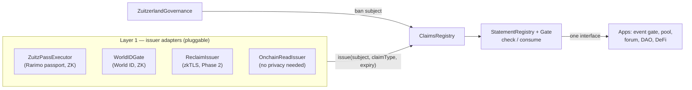
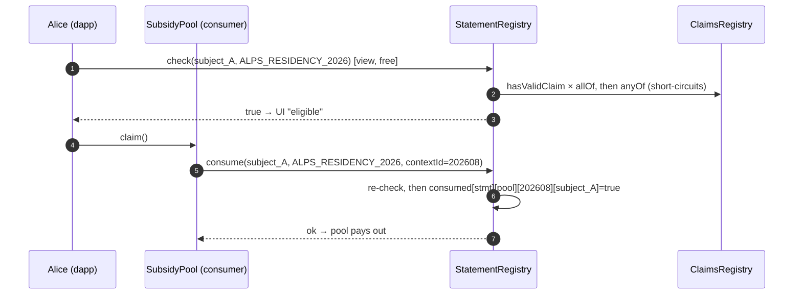

# Zuitzerland zk Statements Layer — Target Architecture

_Written 2026-07-04. This is the architecture for the actual product defined in the original
project doc: a neutral, provider-agnostic, on-chain **zk statements layer** — not "a gated
forum". The forum/event gating is the first demo. Supersedes `ARCHITECTURE.md` §1–8 (which
describe the archived ERC-7812 Path B) and concretizes §9. Current provider integrations
(Rarimo `ZuitzPassExecutor`, `WorldIDGate`) are Phase-0 inputs to this design._

---

## 0. The one design move everything follows from

The target statement —

> "one human AND Swiss resident AND not sanctioned AND attended Zuitzerland May 2025
> AND has never used this pool"

— is intractable as **one proof** (no single circuit or provider covers it) and trivial as
**a conjunction of on-chain claims**. So the layer splits every statement into two layers:

| Layer | What happens | Cost model |
|---|---|---|
| **1. Evidence → Claims** | Each atomic fact is verified by whatever mechanism fits (Rarimo Query proof, World ID, zkTLS, coprocessor, plain on-chain read) via an **issuer adapter**, and recorded as a typed on-chain **claim bound to a nullifier** | ZK verification, paid once per fact |
| **2. Claims → Statements** | A "statement" is a **boolean formula over claim types**, evaluated in plain Solidity (AND / any-of / expiry / epoch / one-time consumption) | A few SLOADs — no ZK |

Adding a new condition = register a claim type + permission an issuer. **Never author a
circuit per condition.** Composition is cheap, transparent, and governable — which is what
makes "verify any provable statement" a product instead of a research program.



---

## 1. Actors & identity model

- **Subject** = a `bytes32` nullifier from a personhood provider, **namespaced by provider**
  (`subject = keccak256(providerId, providerNullifier)`). It is the sybil anchor and the key
  every claim hangs off. Persona-merging across providers is deliberately NOT attempted
  (see §5 — the sybil trade-off is surfaced, not hidden).
- **Issuer** = a contract permissioned to write a given claim type. The two existing gates
  become the first two issuers of `UNIQUE_HUMAN(rarimo)` / `UNIQUE_HUMAN(worldid)`.
- **App** = any contract/dapp that calls `check(subject, statementId)` or
  `consume(subject, statementId, contextId)`. Apps integrate **one interface, not N SDKs**.
- **Governance** = the non-profit multisig initially: registers claim types, statements,
  issuers; bans subjects. Every knob is on-chain → swappable for token/member governance
  later without redesign (the original doc's "transparent rulesets" property).

**Provider-adoption answer (original doc risk §6.1):** adapters *consume providers' existing
verifiers*; providers change nothing and need not even know. Proven twice already — Rarimo
and World ID were integrated without any provider-side cooperation.

---

## 2. The contracts (Phase 1 — implementable as written)

### 2.1 `ClaimsRegistry` — layer-1 output, the spine

```solidity
struct Claim {
    address issuer;
    uint64  issuedAt;
    uint64  expiresAt;   // 0 = never expires
}

interface IClaimsRegistry {
    // -- governance --
    function registerClaimType(bytes32 claimType, string calldata metadataURI) external;
    function setIssuer(bytes32 claimType, address issuer, bool allowed) external;

    // -- issuers --
    function issue(bytes32 subject, bytes32 claimType, uint64 expiresAt) external;
    function revoke(bytes32 subject, bytes32 claimType) external; // issuer or governance

    // -- anyone --
    function hasValidClaim(bytes32 subject, bytes32 claimType) external view returns (bool);
    function getClaim(bytes32 subject, bytes32 claimType) external view returns (Claim memory);

    // -- ban integration (INullifierBanControl, driven by ZuitzerlandGovernance) --
    function setNullifierBanned(bytes32 subject, bool banned) external;
}
```

Rules: `issue` requires `allowed[claimType][msg.sender]`; `hasValidClaim` is
`claim exists && !expired && !banned[subject]`. A ban kills **all** of a subject's claims at
once — the ban primitive moves from per-gate to layer-wide (strictly better than today).

Claim types are `keccak256` tags, e.g. `UNIQUE_HUMAN_RARIMO`, `UNIQUE_HUMAN_WORLDID`,
`ZUITZERLAND_MAY25_ATTENDEE`, `SWISS_RESIDENT`. `metadataURI` points to a JSON descriptor
(display name, issuer docs, evidence mechanism) — the registry stays tiny.

### 2.2 `StatementRegistry` (+ gate) — layer 2, what apps talk to

```solidity
struct Statement {
    bytes32[]  allOf;        // every type required
    bytes32[]  anyOf;        // at least one required (empty = skip); this is where
                             // the sybil-anchor choice lives, e.g. any UNIQUE_HUMAN_*
    bool       consumable;   // one-time semantics (claim/vote/drop)
    string     metadataURI;
}

interface IStatementRegistry {
    function registerStatement(bytes32 statementId, Statement calldata s) external; // governance

    /// Pure eligibility (view) — forums, token-gates, UIs.
    function check(bytes32 subject, bytes32 statementId) external view returns (bool);

    /// Eligibility + one-time consumption, scoped per (app = msg.sender, contextId).
    /// contextId = poolId / proposalId / epoch number — repeated actions are a context
    /// parameter, NOT a redesign (settles the old per-action-nullifier question).
    function consume(bytes32 subject, bytes32 statementId, uint256 contextId) external;
}
```

`consume` records `consumed[statementId][msg.sender][contextId][subject] = true` — scoping by
`msg.sender` means one app can never burn another app's eligibility. Formulas are flat
`allOf + anyOf` **on purpose**: it covers every use case in the original doc; nested boolean
trees are speculative generality (revisit only when a design partner actually needs one).

### 2.3 Issuer refactor of the existing gates (small, non-breaking)

Both gates gain an optional `claimsRegistry` (owner-set) and, in their success path
(`_afterVerify` / end of `verify`), additionally call:

```solidity
claims.issue(keccak256(abi.encode(PROVIDER_ID, nullifier)), UNIQUE_HUMAN_<PROVIDER>, expiry);
```

Their own `usedNullifiers` bookkeeping stays (it is the *proof replay* guard; the registry
handles *eligibility*). `ZuitzerlandGovernance` re-points at the ClaimsRegistry. Everything
already validated (VK match, selector bits, fork tests) carries over untouched.

### 2.4 Zero-ZK issuers — the escape hatch is a first-class citizen

Many "requirements" need no cryptography (`OnchainReadIssuer`: e.g. reads Aave/NFT/ENS state
for `msg.sender`-linked subjects where privacy isn't required) or just an authorized signer
(`AttestorIssuer`: event organizer check-ins → `ZUITZERLAND_MAY25_ATTENDEE`). These make the
layer immediately useful **before** any exotic proof system is integrated, and they are how
the first design-partner demos ship fast.

---

## 3. What each evidence mechanism plugs in as (the ladder, operationalized)

| Mechanism | Issuer adapter | Status / requirement |
|---|---|---|
| Rarimo passport (ZK, on Rarimo L2) | `ZuitzPassExecutor` | Built; blocked only on real-proof replay |
| World ID (ZK, simulator-testable) | `WorldIDGate` | Built; end-to-end testable now |
| Organizer attestation | `AttestorIssuer` | Trivial (Phase 1) — signer allowlist |
| Public on-chain state | `OnchainReadIssuer` | Trivial (Phase 1) — no privacy, links wallet |
| **zkTLS** (off-chain/web2 facts) | `ReclaimIssuer` | Phase 2. Reclaim verification = attestor-signature checks → deployable on Rarimo L2 ourselves. Bind proofs via `context = subject`. Trust caveat: proxy-witness honesty, template brittleness — fine for access, not for treasuries |
| **ZK coprocessor** (private on-chain facts) | `CoprocessorIssuer` | Deferred. Needs a custom private-input circuit (nullifier binding) AND a supported chain (none deploy on Rarimo L2) + cross-chain attestation relay. Integrate only when a concrete paying condition demands it |

---

## 4. Privacy model — honest today, upgradeable tomorrow (Phase 3)

**Phase 1 truth:** claims are **pseudonymous, not unlinkable.** One subject key links a
user's claims to each other and to every app they use (not to their legal identity). For the
launch use cases (event access, community pools) this is acceptable and must be stated
plainly.

**Phase 3 upgrade — and the resurrection of the archived circuit:** mirror claims into an
SMT; a user proves in ZK "a claim of type X exists for my subject" and presents only a
**per-app nullifier**. Apps then see nothing but "eligible + fresh nullifier" — claims
become unlinkable across apps. The required circuit is *generic SMT membership + scoped
nullifier derivation* — which is exactly the archived `membership_proof/` Noir circuit,
already validated against a real dl-solarity SMT (Checks 1 & 2). It was built for the wrong
registry, not wrongly built.

**ERC-7812, used the only way it can be today: we become its first real registrar.** The
Ethereum singleton is verified-empty, so nothing is built *on* it. Instead, Phase 3 commits
the ClaimsRegistry root *into* the singleton under our registrar key
(`getIsolatedKey(ourRegistrar, …)` — leaf format already matched by the archived circuit).
We inherit 7812's portability/standard story and flip the pitch from "depends on an
unpopulated standard" to "first production registrar of the standard".

---

## 5. The multi-provider sybil hole — decided, not mitigated away

N accepted personhood providers ⇒ up to N accounts per person. No meta-registry fixes this
without cross-provider identity linking, which would destroy the privacy properties. The
layer therefore **surfaces the trade-off as statement policy** instead of pretending to
solve it: `anyOf = [UNIQUE_HUMAN_RARIMO]` (strict, lower coverage) vs
`anyOf = [UNIQUE_HUMAN_RARIMO, UNIQUE_HUMAN_WORLDID]` (broad, up-to-2× sybil). The choice is
the app's, made on-chain and transparently. Neutrality-by-honesty is the differentiator.

> To be explicit: the cost of a wide `anyOf` is **sybil cost, not gas cost** — evaluation
> short-circuits on the first valid claim (a few SLOADs). The price is that one human holding
> credentials from N accepted providers is N distinct subjects.

---

## 6. Phasing (each phase is a working product)

| Phase | Ships | Exit criterion |
|---|---|---|
| **0** (in flight) | Rarimo + World ID gates validated (VK ✅, selector ✅, World ID simulator replay, Rarimo real-proof replay) | replay tests green |
| **1** | ClaimsRegistry + StatementRegistry/Gate + issuer refactor + `AttestorIssuer`/`OnchainReadIssuer`; **demo: Zuitzerland event access + one epoch-scoped gated pool** | one real community gates one real thing |
| **2** | `ReclaimIssuer` (zkTLS) + thin proof-request SDK (JSON request format the frontend resolves against whichever provider can satisfy the claim — "WalletConnect for proofs", kept a spec, not a platform) | first off-chain-fact statement live |
| **3** | Claims SMT + per-app nullifiers (archived circuit) + ERC-7812 registrar commitment | cross-app unlinkability live |

**Anti-scope-creep rule** (original doc risk §6.2 — "too abstract"): no registry generality
— nested formulas, statement versioning, cross-chain reads, governance modules — before the
Phase-1 demo has a real external user.

---

## 7. Repo mapping

| Piece | Role in this architecture |
|---|---|
| `src/ZuitzPassExecutor.sol` + `src/rarimo/**` | Issuer #1 (Rarimo). Keep; add claim issuance |
| `src/WorldIDGate.sol` | Issuer #2 (World ID). Keep; add claim issuance |
| `src/ZuitzerlandGovernance.sol` + `INullifierBanControl` | Governance; re-point at ClaimsRegistry |
| `src/ClaimsRegistry.sol`, `src/StatementRegistry.sol`, `src/issuers/*` | **Phase 1 — to build** |
| `eligibility_proof/`, `issuance_proof/` (Noir) | Phase-3 circuits — generalized from the original membership circuit (since removed) |
| ~~Path B (`ZuitzerlandVerifier`, adapters, `NoirVerifierWrapper`)~~ | Removed — superseded by this design |
| `ARCHITECTURE.md` | §1–8 historical (Path B); §9 superseded by this file |

---

## 8. End-to-end flow — Alice and the "Zuitzerland Alps Residency 2026" pool

Worked example. The consumer is a **SubsidyPool** (deployed by event organizers, not by us)
whose access rule is:

> *unique human* (Rarimo **or** World ID — organizers chose broad coverage, knowingly
> accepting the §5 2× sybil trade-off) **AND** *attended Zuitzerland May 2025* **AND**
> *over 18* **AND** *has not yet claimed this month*.

### Act 0 — one-time setup (no users yet)

Governance (multisig) on Rarimo L2:
1. `ClaimsRegistry.registerClaimType()` × 4: `UNIQUE_HUMAN_RARIMO`, `UNIQUE_HUMAN_WORLDID`,
   `ZUITZ_MAY25_ATTENDEE`, `OVER_18`.
2. `setIssuer(...)`: `ZuitzPassExecutor` → `UNIQUE_HUMAN_RARIMO` **and** `OVER_18` (both fall
   out of one passport Query proof — age is a selector bit already supported);
   `WorldIDGate` → `UNIQUE_HUMAN_WORLDID`; the organizers' `AttestorIssuer` →
   `ZUITZ_MAY25_ATTENDEE`.
3. **The organizers** (a consumer, not us) register their statement:
   `registerStatement(ALPS_RESIDENCY_2026, { allOf: [ZUITZ_MAY25_ATTENDEE, OVER_18],
   anyOf: [UNIQUE_HUMAN_RARIMO, UNIQUE_HUMAN_WORLDID], consumable: true })`.
4. Organizers deploy `SubsidyPool`, which holds funds and knows the statement id. **That is
   the whole integration** — no SDK, no provider contact; it will only call `check`/`consume`.

### Act 1 — Alice acquires claims (once each; reusable across every app forever)

**1a. Personhood + age (ZK, Rarimo).** Frontend reads the policy from the executor's getters,
requests a Query proof from RariMe, Alice submits `execute(root, currentDate, payload, proof)`.
The executor checks root freshness against Rarimo's live `RegistrationSMT` (Rarimo's tree —
the only SMT that exists in Phase 1), checks her nullifier isn't banned/used, verifies the
Groth16 proof, then (the §2.3 hook):

```solidity
subject_A = keccak256(RARIMO_PROVIDER_ID, nullifier_rarimo);
claims.issue(subject_A, UNIQUE_HUMAN_RARIMO, now + 180 days);
claims.issue(subject_A, OVER_18,             now + 180 days);
```

The chain learns only: "some passport holder, pseudonym `subject_A`, is a unique adult
human." (Use a fresh wallet or relayer if submitter-address linkage matters.)

**1b. Event attendance (attestation, zero ZK).** At the reunion desk an organizer scans
Alice's ZuitzPass QR (= `subject_A`) and their signer calls
`AttestorIssuer.attest(subject_A, ZUITZ_MAY25_ATTENDEE)` → third claim, expiry 0. A fact no
ZK provider could ever prove entered the same composable system for one signature.

Alice's registry row: `{UNIQUE_HUMAN_RARIMO ✓, OVER_18 ✓, ZUITZ_MAY25_ATTENDEE ✓}`.

### Act 2 — Alice uses the pool (repeatable)



Precision points:
- **Consumption is scoped to `msg.sender`** — the forum checking the same statement can never
  burn Alice's pool eligibility.
- **`contextId` = the month** (202608). September passes 202609 → Alice claims again. "Once
  per epoch" is a parameter, not a redesign.
- Double-claim in August → `AlreadyConsumed`. A friend with only a World ID → different
  subject, fails `allOf` (no attendance claim). Alice holding BOTH providers *and* attested
  under both subjects → the §5 trade-off the organizers accepted with their wide `anyOf`.
- **Ban:** governance calls `ClaimsRegistry.setNullifierBanned(subject_A, true)` → every
  `hasValidClaim` for her returns false, everywhere, at once.

**Phase-1 honesty:** pseudonymous, not unlinkable — pool and forum both see `subject_A` and
can correlate. Phase 3 removes exactly this.

### Act 3 — Phase-3 delta: the SMT changes how Alice *presents*, not how claims are made

Acts 0–1 unchanged. New, on every issue/revoke/ban, `ClaimsRegistry` also updates a leaf in
an on-chain **claims SMT** (dl-solarity tree — same library as our validated fixtures):

```
leaf key   = Poseidon(subject, claimType)
leaf value = Poseidon(issuer, issuedAt, expiresAt)
→ new claimsRoot, timestamped, kept in a root history
```

Mappings stay the source of truth; the SMT is the **provable index** over them.

Act 2 rewritten: Alice's client fetches her Merkle paths from an indexer and proves locally
(the resurrected `membership_proof/` circuit, generalized): *"under claimsRoot R there exist
valid leaves of the required types for one subject whose secret I control — and here is
`appNullifier = Poseidon(secret, poolAppId, 202608)`."* She submits
`(proof, R, appNullifier)`; the pool's gate checks R is recent, verifies, and consumes
`appNullifier`. The pool now learns **only** "an eligible person, nullifier X for this pool
this month"; the forum sees a *different* nullifier for the same Alice. `subject_A` never
appears on the consumer side again. Cost: client-side proving (~seconds) + one circuit audit.

**ERC-7812 rides on the same root:** a relayer posts `claimsRoot` to our
`ZuitzStatementsRegistrar` on Ethereum, which writes it into the singleton at
`getIsolatedKey(ourRegistrar, ZUITZ_CLAIMS_KEY)` — the first real statement the singleton has
ever held (it is permissionless; being first requires no permission, only a transaction). A
lending app on Base can then gate on "Zuitzerland-verified adult human" by verifying Alice's
same claims-proof against the root read from Ethereum — a chain we never deployed to.

---

## 9. Phase-3 design decisions (2026-07-06) — master identity + strong unlinkability

Design review promoted Phase 3 from "someday" to the **PoC target**. §4 named the direction; the
concrete key model, the two circuits, the on-chain changes, and the worked "Cannes 2026" flow live
in **[`PHASE3_UNLINKABLE_DESIGN.md`](PHASE3_UNLINKABLE_DESIGN.md)**. The decisions that pin it:

- **Master identity, not per-provider subjects.** One secret `s` per person, `idc = Poseidon(s)`;
  every claim hangs off `idc`. This is the deliberate reversal of §1/§5's per-provider
  `keccak256(providerId, nullifier)` — persona-merging is now the *point*, done privately.
- **Cross-app unlinkability is a hard requirement.** App-time becomes a client-side ZK proof
  (generalized `membership_proof`) emitting a per-app nullifier `Poseidon(s, appId, contextId)`;
  the app sees "eligible + fresh nullifier", never `idc` or any connector. `check`/`consume` as an
  SLOAD survives only for statements explicitly flagged public.
- **Strong private binding.** Even connecting a provider reveals no `provider ↔ idc` link — via a
  two-step anonymous-credential flow (verify provider → register a credential commitment; later,
  privately redeem it into an `idc` claim leaf). The existing `WorldIDGate.usedNullifiers` is the
  one-credential-per-human guard; no new nullifier bookkeeping.
- **Expiry-driven revocation** (no non-membership proof) — claims carry `expiresAt`; revocation =
  lapse; renewal re-proves against the provider's current credential root. Keeps the circuit lean.
- **One canonical claims SMT on an L2**, root anchored into ERC-7812 on L1 for other chains to read
  — the "single registry across chains" the original vision wanted, without a registry-per-chain.
- **WalletConnect-for-proofs UX** — connect providers once (durable facts become claims), evaluate
  at join. Volatile facts (e.g. ETH balance) are live-checked, not stored as claims.

Build order: **Circuit A (eligibility) first** — it is ~80% of Circuit B and de-risks
SMT-conjunction-in-Noir. See the spec §8.
